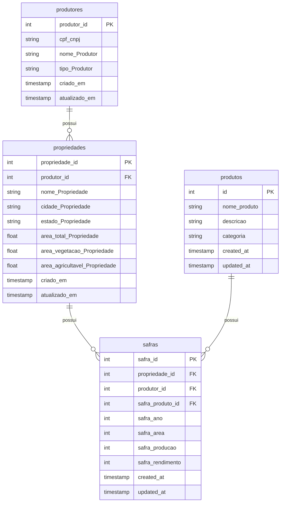

# 🌾 Brain Agriculture

API REST para gestão de Agricultores, Fazendas, Culturas e Safras. Projeto desenvolvido em Flask com SQLAlchemy e Postgre seguindo princípios de Clean Architecture.

---

## 🐳 Como executar com Docker

### 1. Clone o repositorio

### 2. Suba os containers

```bash
docker-compose up --build
```

> A aplicação Flask será iniciada em `http://localhost:80`  
> O banco PostgreSQL estará acessível na porta `5432`

---
## 📚 Documentação
Casos de uso disponibilizados na pasta casos_de_uso contendo toda a API mapeada e configurada no postman
---

## 📁 Estrutura de Pastas (Clean Architecture)

```
src
├── app
│   ├── models
│   ├── resources
│   └── tests 
├── nginx
```

---

## ✅ Endpoints Disponíveis

### 🌾 Produtores

| Método | Rota              | Descrição                          |
| ------ | ----------------- | ---------------------------------- |
| POST   | /produtores       | Cadastra novo agricultor           |
| GET    | /produtores       | Lista todos os agricultores        |
| PUT    | /produtores       | Atualiza os dados de um agricultor |
| DELETE | /produtores       | Remove um agricultor               |

---

### 🏡 Fazendas

| Método | Rota          | Descrição                        |
| ------ | ------------- | -------------------------------- |
| POST   | /propriedades | Cadastra nova fazenda            |
| GET    | /propriedades | Lista todas as fazendas          |
| PUT    | /propriedades | Atualiza os dados de uma fazenda |
| DELETE | /propriedades | Remove uma fazenda               |

---

### 🌱 Produtos

| Método | Rota          | Descrição                        |
| ------ | ------------- | -------------------------------- |
| POST   | /produtos     | Cadastra nova cultura            |
| GET    | /produtos     | Lista todas as culturas          |
| PUT    | /produtos     | Atualiza os dados de uma cultura |
| DELETE | /produtos     | Remove uma cultura               |

---

### 🌾 Safras

| Método | Rota        | Descrição                      |
| ------ | ----------- | ------------------------------ |
| POST   | /safras     | Cadastra nova safra            |
| GET    | /safras     | Lista todas as safras          |
| PUT    | /safras     | Atualiza os dados de uma safra |
| DELETE | /safras     | Remove uma safra               |

---

## 🧱 Diagrama do Banco de Dados


